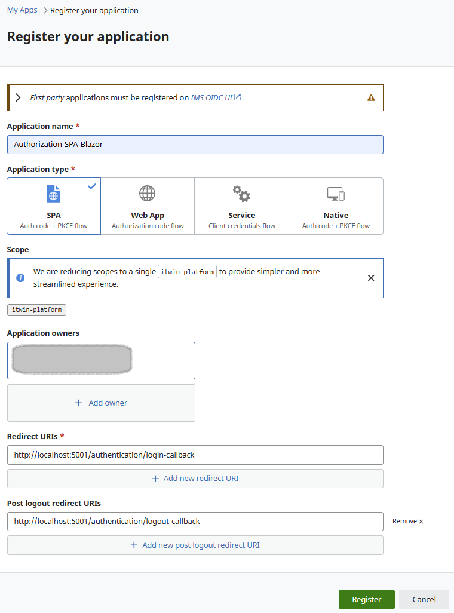
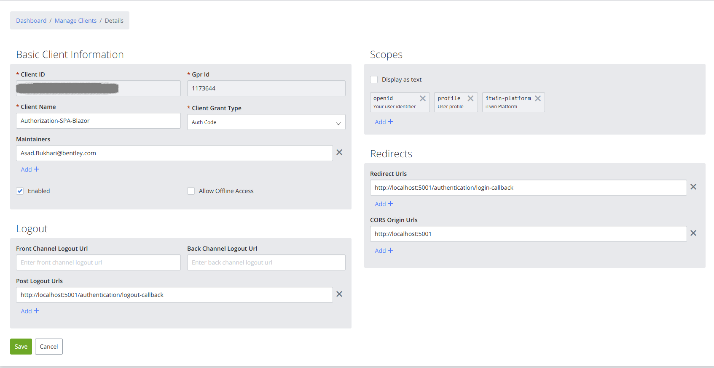

# Implementing Bentley IMS Authentication and Authorization in a Blazor Standalone Application

This guide provides a starting point for implementing Bentley authentication and authorization in a Blazor Standalone Application (BSA). Once authorized using an Access Token, you can make requests to iModel APIs exposed by the iTwin Platform. By providing an iModel GUID, the application retrieves and displays the corresponding iModel details.

## Register Client

1. Choose "SPA" as your application type when [registering for use with this client](https://developer.bentley.com/register/).

    

2. After the application is registered, you will get the clientId. Copy it.

3. When the client is registered, navigate to https://imsoidcui.bentley.com/ and go to Manage Applications:

        a. Select your created Client ID.
        b. Edit the Client ID settings.
        c. Add the following scopes: openid and profile.
        d. The client should now have scopes "openid profile itwin-platform"
        

    

    **Note:** Without the openid and profile scopes, default project settings will not function correctly.

4. Update appsettings.Development.json with client id details

    Prior to running the app, you will need to add OIDC client id details appsettings.Development.json file:

        {
        "Local": {
            "Authority": "https://ims.bentley.com",
            "ClientId": "[Provide the SPA client id]",
            "ResponseType": "code",
            "RedirectUri": "http://localhost:5001/authentication/login-callback",
            "PostLogoutRedirectUri": "http://localhost:5001/authentication/logout-callback",
            "DefaultScopes": [
            "itwin-platform"
            ]
        }
        }

   To install dependencies, build, and run the project, follow the instructions by Navigating your command prompt/VS Code terminal to the "IMS-Bentley" folder.

## Install Dependencies

        dotnet restore

## Build and Run Project

        dotnet build
        dotnet run

## To create the Blazor application from scratch

From the command line or VS Code, create a new project using the Blazor WebAssembly template with individual authentication:

        dotnet new blazorwasm --name IMS-Bentley --auth Individual

Update the **applicationUrl** in **launchSettings.json** to match the redirect URLs specified in the registered client.
