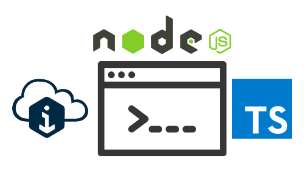

# iTwin.js Console Logger

This is a very simple starting guide to initialize iTwin.js Console Logger. Enabling and disabling logger categories based on the Logger.config.json

   <p align="center">
      
   </p>

You can set the default log level using the LOG_LEVEL variable in the .env file. The valid values for LOG_LEVEL are:

    /** Tracing and debugging - low level */
    Trace = 0,
    /** Information - mid level */
    Info = 1,
    /** Warnings - high level */
    Warning = 2,
    /** Errors - highest level */
    Error = 3,
    /** Higher than any real logging level. This is used to turn a category off. */
    None = 4


## Install Dependencies

   ```sh
   npm install
   ```

## Build and Start Project

   ```sh  
   npm build
   npm start
   ```

## References

1. [Logging](https://www.itwinjs.org/learning/common/logging/)
2. [Step-by-Step Guide: Implementing Logging in iTwin.js Applications](https://medium.com/@asad_bukhari/step-by-step-guide-implementing-logging-in-itwin-js-applications-28ce949d68a8)
