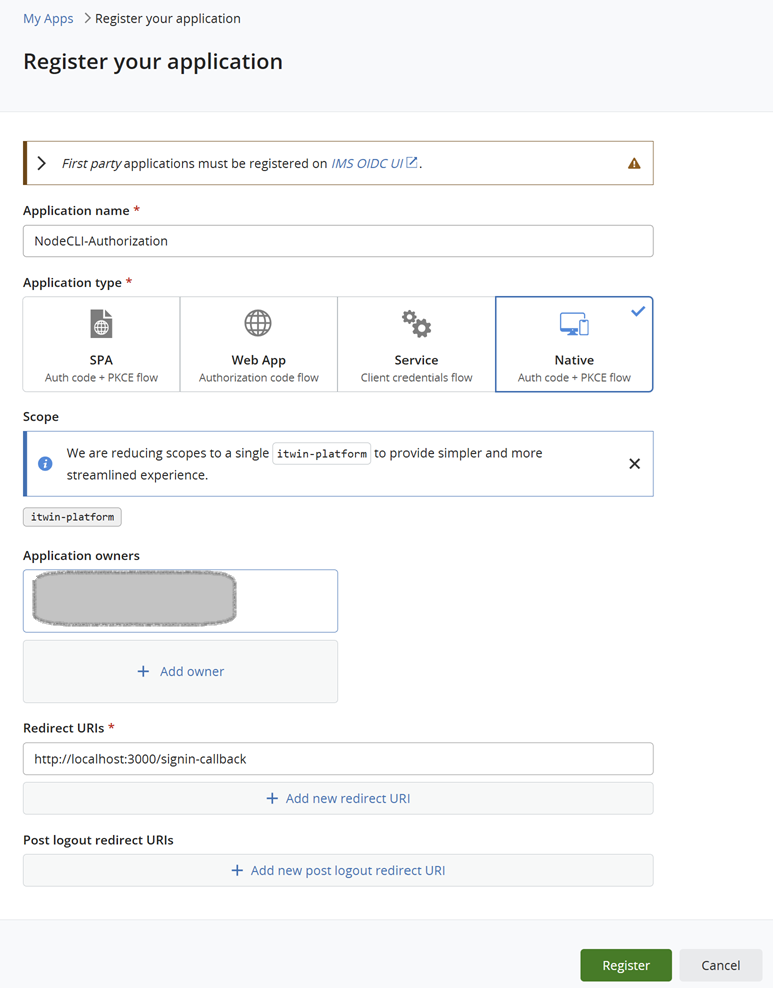

# Checkpoint connection

This is a very simple starting guide to establish an IModelConnection to a Checkpoint of an iModel.

## Register Client

1. Choose "Native" as your application type when [registering for use with this client](https://developer.bentley.com/register/).

    

2. After the application is registered, you will get the clientId. Copy it.

3. Place the clientId in .env file

    ```sh
    CLIENT_ID=[Add your clientId here]
    ```

4. Client_ID is used in `index.ts` file creating the **NodeCliAuthorizationClient**:

    ```typescript
    const authClient = new NodeCliAuthorizationClient({clientId, scope: "itwin-platform"});
    ```

    Note: If the `redirectUri` is not specified, it will default to `redirectUri: "http://localhost:3000/signin-callback"`.

    If you have set a different `redirectUri` while registering the application, then specify it in the `redirectUri`:

    ```typescript
    const authClient = new NodeCliAuthorizationClient({clientId, scope: "itwin-platform", redirectUri: "http://localhost:5000/signin-callback"});
    ```

## Install Dependencies

   ```sh
   npm install
   ```

## Build and Start Project

   ```sh  
   npm build
   npm start
   ```

## References

1. [CheckpointConnection](https://www.itwinjs.org/reference/core-frontend/imodelconnection/checkpointconnection/)
2. [App Backend Development](https://www.itwinjs.org/learning/backend/)
3. [iModelHub Access Backend](https://github.com/iTwin/imodels-clients/tree/main/itwin-platform-access/imodels-access-backend)
