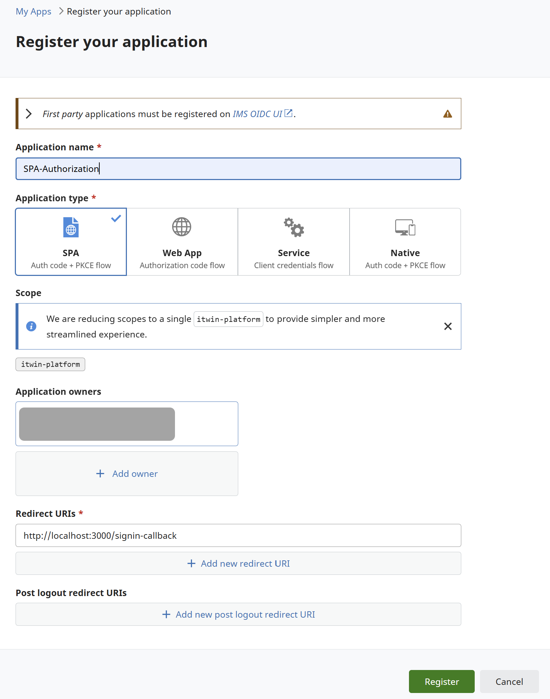

# iTwin SPA with Authorization Template for Create React App

This is a template for creating a Single Page Application (SPA) with Bentley IMS Authorization.

## Getting Started

To use this template, you need to have Node.js and npm installed on your machine.

## Installation

## Create a new React app using this template:

```bash
    npx create-react-app my-itwin-app --template itwin-auth-spa
```

## Navigate to your project directory:

```bash
    cd my-itwin-app
```

## Register Client

a. Choose "SPA" as your application type when [registering for use with this client](https://developer.bentley.com/register/).



b. After the application is registered, you will get the clientId. Copy it.

c. Environment Variables

Prior to running the app, you will need to add OIDC client configuration to the variables in the .env file:

```plaintext
    # ---- Authorization Client Settings ----
    IMJS_AUTH_CLIENT_CLIENT_ID=""
    IMJS_AUTH_CLIENT_REDIRECT_URI=""
    IMJS_AUTH_CLIENT_LOGOUT_URI=""
    IMJS_AUTH_CLIENT_SCOPES=""
```

d. Client_ID is used in `Auth.ts` file creating the **BrowserAuthorizationClient**:

```typescript
    const client = new BrowserAuthorizationClient({
                        clientId: // find at developer.bentley.com
                        redirectUri: // find/set at developer.bentley.com
                        scope: // find/set at developer.bentley.com
                        authority: // ims.bentley.com
                        postSignoutRedirectUri: // find/set at developer.bentley.com (see note below)
                        responseType: "code"
                        });
```

## Project Structure

The project structure is as follows:

```plaintext
my-itwin-app/
├── node_modules/
├── public/
├── src/
│   ├── App.tsx
│   ├── index.tsx
│   └── ...
├── .gitignore
├── package.json
├── README.md
└── tsconfig.json
```

## Available Scripts

In the project directory, you can run:

### `npm run build`

Builds the app for production to the `build` folder.

### `npm start`

Runs the app in the development mode. Open [http://localhost:3000](http://localhost:3000) to view it in the browser.
